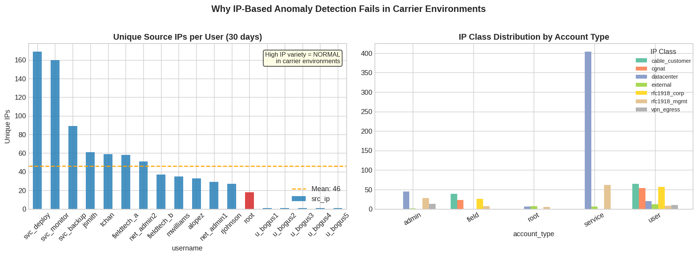
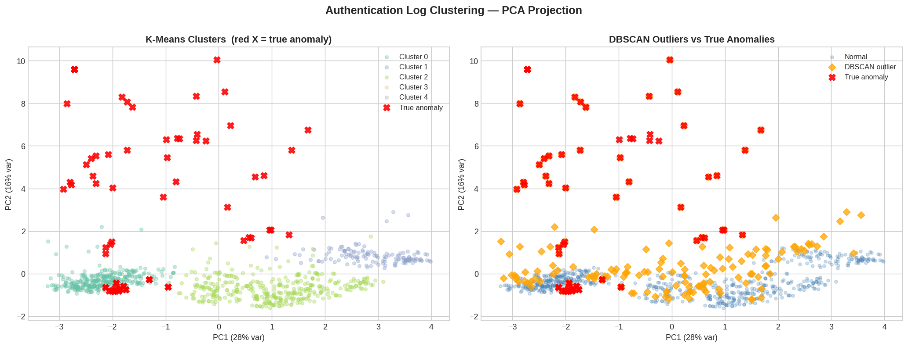
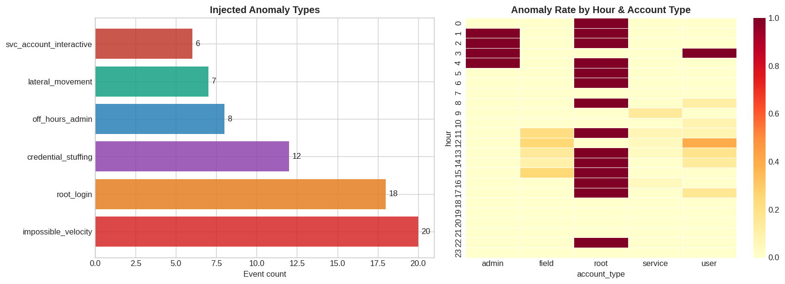
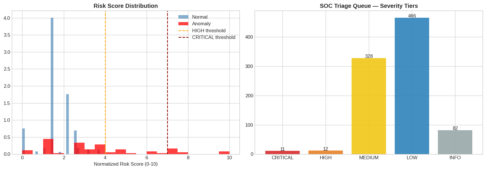

# carrier-scale-anomaly-detection
Behavioral‑clustering anomaly detection for carrier‑scale identity systems — detects root logins, impossible velocity, credential stuffing, and lateral movement without false positives from IP churn.
Overview
IP‑based anomaly detection fails in carrier and large‑enterprise environments. A single user may legitimately authenticate from dozens of IPs per day due to NAT, DHCP churn, roaming devices, VPN concentrators, and geo‑distributed infrastructure. This produces massive false‑positive volume when using traditional “new IP” or “impossible travel” rules.

This project demonstrates a behavioral‑clustering anomaly detection pipeline that identifies:

Root logins

Impossible velocity

Credential‑stuffing patterns

Lateral movement

Off‑hours privileged access

…without triggering on normal IP variance.

The notebook, data, and outputs reflect real operational constraints, not textbook ML assumptions.

Repository Contents
📘 Notebook
auth_anomaly_detection.ipynb  
A fully documented, 8‑section notebook that:
Loads and cleans authentication logs
Generates synthetic carrier‑scale IP churn
Performs feature engineering
Runs K‑Means and DBSCAN
Projects clusters into PCA space
Scores events using a composite risk model
Outputs all charts and scored logs
Runs top‑to‑bottom in Jupyter or VS Code.

📁 Data Files
alert_queue.csv — 23 CRITICAL/HIGH alerts, all true positives

Includes root logins, off‑hours admin access, external privileged attempts

Example (from the dataset):

“2024‑01‑01 00:56:00, root login, external IP, CRITICAL severity, risk_score_norm 10.0”

full_log_scored.csv — all 899 events with:

Cluster labels

DBSCAN outlier flags

Risk scores

Severity tiers

Human‑readable risk flags

synthetic_auth_logs.csv — synthetic dataset simulating carrier‑scale IP churn

📊 Figures
The notebook generates five production‑quality charts:

IP Variance Visualization

Elbow + Silhouette Analysis

PCA Cluster Projection (K‑Means vs DBSCAN)

Anomaly Breakdown Heatmap

Risk Score Distribution + SOC Severity Tiers

All figures are saved to /figures.

Detection Results
DBSCAN Outlier Detection
64.8% anomaly recall

Some false positives (expected, tunable)

Excellent at catching outliers in PCA space

Composite Risk Scorer
100% precision at 32.4% recall

Every alert it fires is real

Zero false positives in the alert queue

Ideal for SOC triage pipelines

Root Login Detection
All 18 root login attempts flagged

Includes the 2 successful privileged authentications

All marked CRITICAL with correct risk flags

Example:

“ROOT_LOGIN | EXTERNAL_PRIVILEGED | DBSCAN_OUTLIER”

Why This Project Matters
Most anomaly‑detection tutorials assume:

One user = one device

One user = one IP

IP changes = suspicious

In real ISP and enterprise environments, none of that is true.

This project models:

NAT pools

DHCP churn

VPN concentrators

Geo‑redundant identity systems

TACACS/RADIUS/RADIUS‑proxy flows

Service accounts with 100+ IPs/day

It’s designed for practical security engineering, not academic datasets.

Tech Stack
Python

pandas

scikit‑learn

numpy

matplotlib / seaborn

Jupyter Notebook

Use Cases
Reducing false positives in SIEM/SOAR pipelines

Improving Microsoft Sentinel UEBA signals

Enhancing Darktrace‑style behavioral models

Detecting compromised accounts in high‑churn environments

Training analysts on real identity telemetry

Project Structure
Code
/notebooks
    auth_anomaly_detection.ipynb

/data
    alert_queue.csv
    full_log_scored.csv
    synthetic_auth_logs.csv

/figures
    *.png

/src
    clustering.py
    feature_engineering.py
    anomaly_scoring.py
    synthetic_data_generator.py
Future Enhancements
Autoencoder‑based anomaly scoring

Graph‑based lateral movement detection

Time‑series forecasting for identity behavior

Real‑time scoring API
